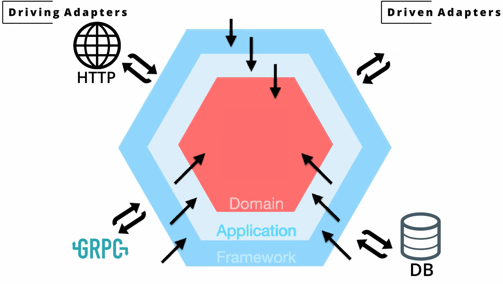

# A Golang app following the hexagonal architecture pattern

## What is Hexagonal Architecture?

The arrows in the image show the direction for dependency injection, i.e. outer layer depends on the inside layer not the other way around.

<a href="https://www.youtube.com/watch?v=MpFog2kZsHk">
    
    
How To Structure Your Go App - Full Course [ Hex Arch + Tests ] by 
Kantan Coding

</a>

<a href="https://netflixtechblog.com/ready-for-changes-with-hexagonal-architecture-b315ec967749">
    
    
Ready for changes with Hexagonal Architecture by netflixtechblog.com

</a>

